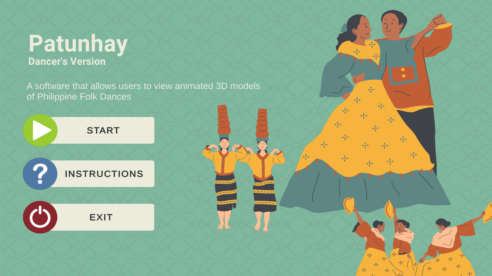
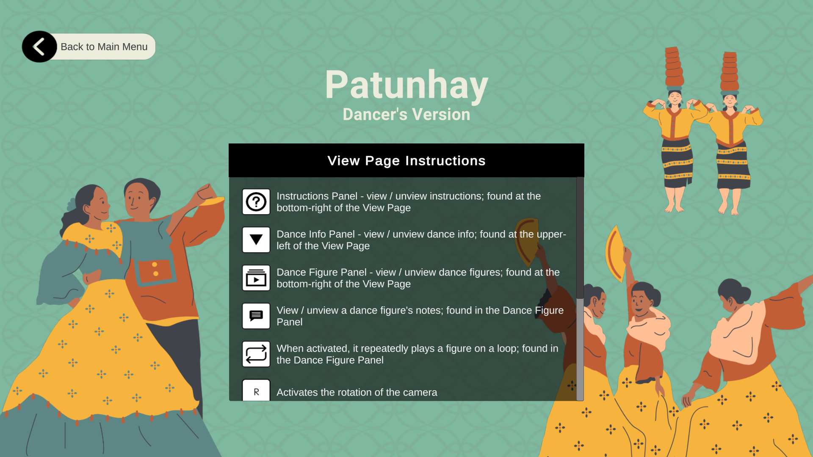
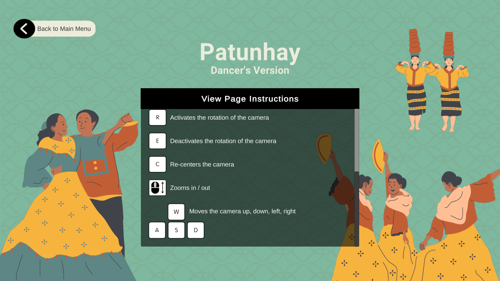
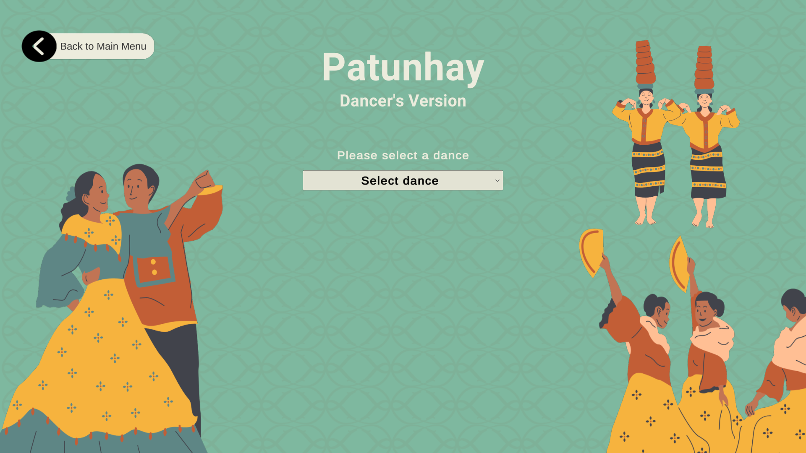
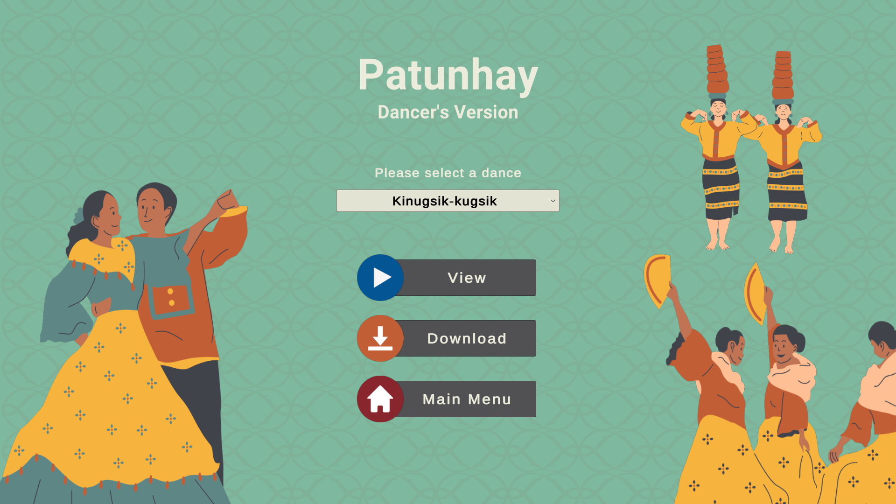
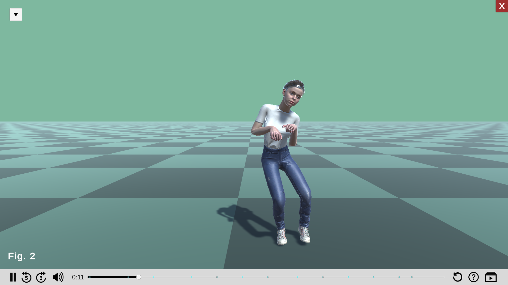
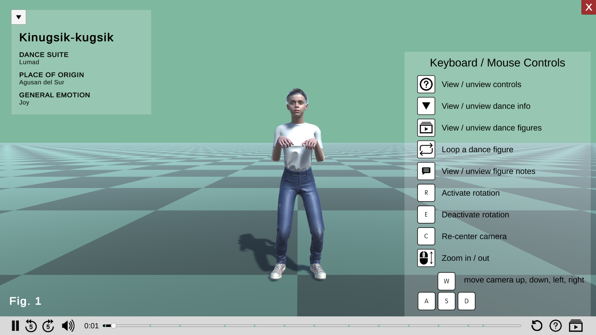
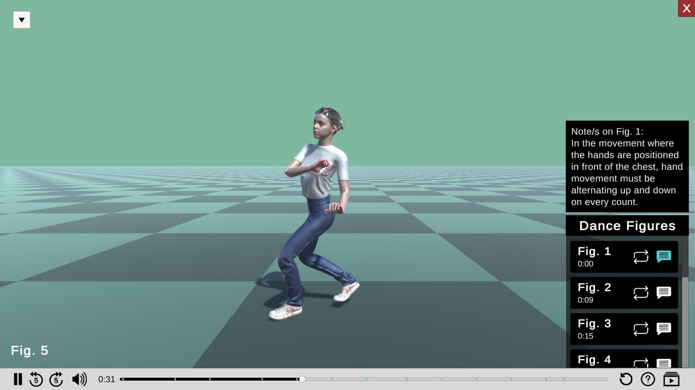

# <h1>Patunhay</h1>

This is Patunhay, a software that allows users to view motion capture animated 3D models animated 3D models of Philippine folk dances.

# <h3>List of Dances in the Application</h3>
**1st Contribution** 
Date Added: July 2023 
Performed by: Dancers from La Salle Dance Company - Folk 
Staged by: Mr. Peter Alcedo Jr.
Organized and Processed by: Juan Paolo Abaca, Sabrina Mykel Dela Cruz, Anna Patricia Desembrana, and Clarissa Mae Mandadero
1. Kinugsik-kugsik
   - Researcher: Ramon Obusan, National Artist
2. Lapay Bantigue
   - Researcher: Ramon Obusan, National Artist
3. Pangalay
   - Choreographer: Nicole Clavel
4. Pattong
   - Resource Person: Dr. Maria Aplaten
5. Jota Gumaqueña
   - Researcher: Francisca Reyes Aquino

**2nd Contribution** 
Date Added: October 2024 
Performed by: Dancers from La Salle Dance Company - Folk 
Staged by: Mr. Peter Alcedo Jr. 
Organized and Processed by: Vincent Adrian Avila, Francis Emmanuel Tamayo, Shanna Raven Tan, and Angel Lou Yabut
6. Kinaransa
   - Resource Person: Mr. Peter Alcedo Jr.
7. Putritos
   - Resource Person: Mr. Peter Alcedo Jr.
8. Itik-Itik
   - Resource Person: Mr. Peter Alcedo Jr.
9. Jota Mallagueña
   - Resource Person: Mr. Peter Alcedo Jr.
10. Kuratsa
   - Resource Person: Mr. Peter Alcedo Jr.

# <h3>How to Run the Application</h3>
1. Clone this repository.
2. Navigate to the cloned version of this repository.
3. Please see the **Other Necessary Files** section for instructions on how to download and where to place other files needed by the application
4. Run **Patunhay.exe** found in the Patunhay_Application folder.
5. Select a dance in the appplication that you want to view.

# <h3>How to Download the Files of a Dance</h3>
- **Option A**: Go to the Patunhay_Files folder and save the files of your desired dance to your local computer.
- **Option B**: Run the Application and click the "Download" button after selecting a dance.

# <h3>Application Overview</h3>
1. **Home Page**: the landing page of the application.

2. **Instructions Page**: shows instructions on the various controls in the View Page.

3. **Dance Information Page**: allows users to select a dance that they want to view. After selecting, users can choose to view the dance or download the dance's corresponding files.

5. **View Page**: allows users to view an animated 3D model of a Philippine folk dance. Users may control their viewing experience by using the various controls, as stated in the Instructions Page.

# <h3>Other Necessary Files</h3>
Some files are of the application are too large to upload to GitHub. Please refer to the Google Drive links below for these files
1. `sharedassets4.assets.resS`
- `https://drive.google.com/drive/folders/1hUybvRk1gbjo--IOzwuaXRFQ5LSw6WbI?usp=sharing`
- Please place this file in `Pa2nhay_Application/Patunhay_Data/` 

# <h3>Contact Persons</h3>
If you want to contribute in the list of dances or have any questions, please contact the following persons:
- Juan Paolo Abaca [juan_abaca@dlsu.edu.ph]
- Sabrina Mykel Dela Cruz [sabrina_mykel_delacruz@dlsu.edu.ph]
- Anna Patricia Desembrana [anna_desembrana@dlsu.edu.ph]
- Clarissa Mae Mandadero [clarissa_mandadero@dlsu.edu.ph]
- Vincent Adrian Avila [vincent_avila@dlsu.edu.ph]
- Francis Emmanuel Tamayo [francis_tamayo@dlsu.edu.ph]
- Shanna Raven Tan [shanna_tan@dlsu.edu.ph]
- Angel Lou Yabut [angel_lou_yabut@dlsu.edu.ph]

   
